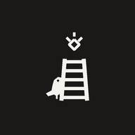
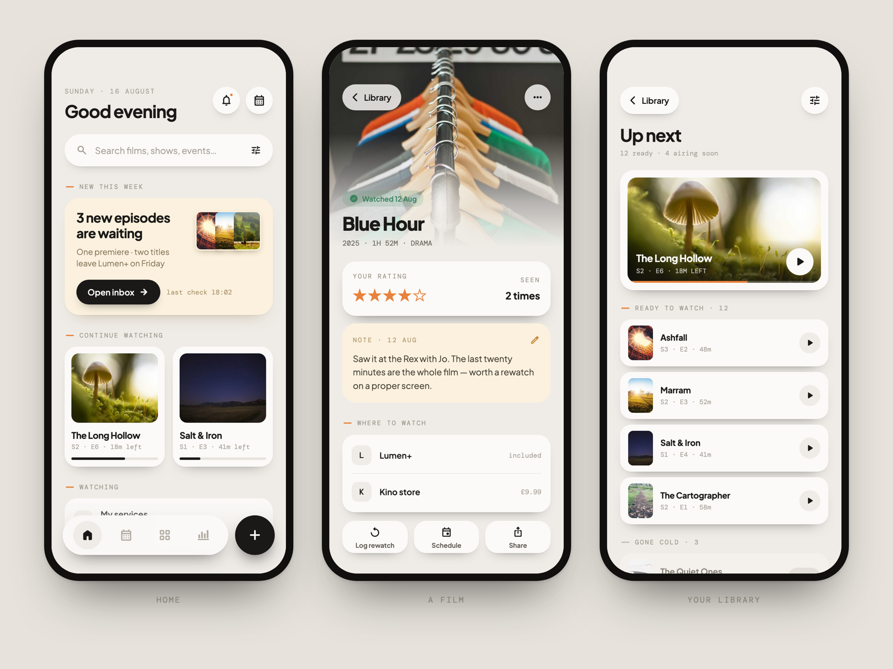

# Kati

**One warm surface for everything you keep track of.**

Films and series, books, music, health, meals, money and habits —
with a real calendar as the spine, not a widget bolted on the side.

**🚧 Under active development.** Not released yet, and not yet stable.

 

 

## What it does

**Four places, and they never move** — Home, Calendar, Library and Stats. Sections add shelves and
feeds rather than tabs, so the app never grows a fifth place to look. Turn a section off and it
leaves the home screen, the calendar feed and the shelf together. Kati is only as big as you ask
for.

**A title is not a row in a list.** A film remembers what you rated it, how many times you have
seen it, where you can watch it and the note you wrote on the way home. A book carries your rating
beside the community's, the edition you actually own, and your pace in pages per day.

**The calendar is real.** It syncs over CalDAV, survives conflicts, and everything else in the app
lands on it — an episode airing, a meal planned, a dose due, a subscription renewing.

**Search covers everything at once** — titles, calendar entries and your own notes — and tells you
which is which.

**Persian throughout.** Right-to-left, Shamsi calendar, Persian numerals, the week starting on
Saturday. Not a translation layer over an English app. Text scales to 235% and the layout is drawn
for it.

**It stays yours.** No account, no sign-in, no server — everything is one file on this phone. Back
the whole thing up into a single file you keep wherever you like, optionally sealed with a
passphrase, and restore it on a new phone. Coming from Goodreads, StoryGraph, Letterboxd, Trakt,
MyAnimeList or AniList? Name your tracker and Kati does the column mapping for you.

## Built with

Kati is an Elixir app. The BEAM runs **on the device** and the interface is real native Jetpack
Compose — not a webview, not a bridge to JavaScript.

| | |
|---|---|
| **[Mob](https://hex.pm/packages/mob)** | Elixir on the phone, rendering native Compose. Screens are `Mob.Screen` modules and the `~MOB` sigil is the markup. |
| **[Mishka Chelekom](https://mishka.tools/chelekom)** | The component library the interface is assembled from — pills, chips, sheets, list rows, theme icons. |
| **[Ash](https://ash-hq.org)** | The domain layer, over SQLite on the device. |

Where a component did not exist yet it was added to Mishka Chelekom rather than forked in here.
Where the native shell needed a patch mob does not have yet, the patch is fenced and ledgered in
[`native/LEDGER.md`](native/LEDGER.md) with its reasoning, so it can be retired the day upstream
lands it.

The design is 152 artboards drawn in Claude Design and kept in
[`test/design/screens/`](test/design/screens) — the app is checked against them rather than against
a memory of them.

 

Built by [Shahryar Tavakkoli](https://github.com/shahryarjb) · part of
[Mishka Group](https://github.com/mishka-group)

